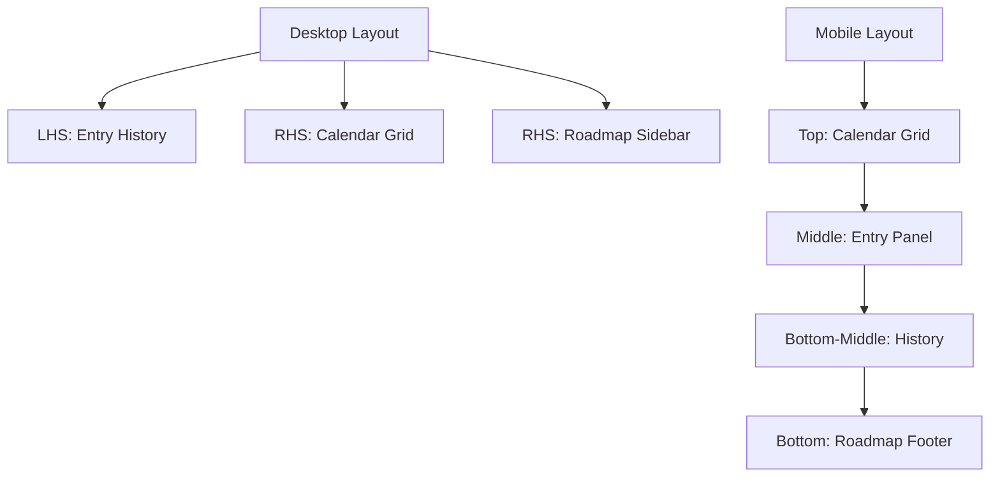

# 🌓 Chronicle: The Premium Interactive Timeline Engine

> "Precision planning meets tactile elegance."

Chronicle is a high-performance, dark-mode-first calendar application designed for the modern documentation specialist. It bridges the gap between a static calendar and a dynamic project timeline, offering a high-density "Neo-Glassmorphic" interface powered by Next.js and Tailwind CSS.

---

## 💎 Core Vision
Chronicle was built to solve the "Interaction Gap" in digital planning. Instead of clunky forms and rigid grids, it offers a physics-based experience where every date selection feels meaningful and every month change feels tactile.

### 🚀 High-Impact Technical Features
| Feature | Implementation | UX Benefit |
| :--- | :--- | :--- |
| **3D Page Flip Navigation** | Framer Motion + perspective transforms | Physical feel while switching months |
| **Precision Range Engine** | Click, Drag, Keyboard + reverse logic | Flexible and intuitive selection |
| **Live Range Preview** | Hover + drag tracking | Instant feedback before selection |
| **Recurring Timeline Engine** | Weekly & Monthly logic | Supports habits and repeated planning |
| **Dynamic Selection Feedback** | Real-time duration + date display | Improves clarity and confidence |
| **Exportable Timeline** | `html-to-image` + `jsPDF` | Shareable, real-world utility |
| **Adaptive Accent Themes** | CSS variables + runtime injection | Personalized visual experience |
| **Fluid Interaction System** | Micro-interactions + transitions | Premium UX feel |
| **Fluid Responsiveness** | Adaptive layout switching | Optimized across all devices |

---

## 🏗️ Architectural Component Breakdown

### 1. `WallCalendar.tsx` (The Command Center)
The central architecture of the app. It manages the layout shift between Desktop (7:5 Split) and Mobile (Inverted Stack).
- **Desktop Logic**: Dates on RHS, Notes on LHS. Roadmap integrated into RHS Sidebar.
- **Mobile Logic**: Dates (Top) → Entry Panel (Middle) → History → Roadmap (Bottom).
- **Global Theme Injection**: Dynamically calculates and injects CSS variables for Accent colors (Classic, Emerald, Rose, etc.).

### 2. `CalendarGrid.tsx` (The Engine)
A high-frequency interaction component that handles the heavy lifting of date math and animations.
- **3D Animation Engine**: Uses `AnimatePresence` with `rotateY` transforms. It detects the *direction* of time (Forward/Backward) to flip the page correctly.
- **Perspective Projection**: A `1200px` CSS perspective is applied to the grid container to give the 3D transforms depth and weight.

### 3. `NotesPanel.tsx` (The Chronicler)
A dense information hub for recording events and memos.
- **Smart Suggestions**: Real-time text parsing detects keywords (e.g., "fitness," "urgent," "meeting") to auto-suggest categories.
- **Multi-Temporal Recording**: Supports single-day notes and multi-day timeline spans with duration calculation.
- **Recurrence Support**: Options for Weekly and Monthly persistence.

---

## 📱 Mobile-First Design Philosophy
Chronicle doesn't just "squish" for mobile; it reconfigures its hierarchy.



### Mobile Optimizations:
- **Root Scale**: The app is tuned for a `12px` font root scale for maximum density.
- **Aspect-Ratio Cells**: Calendar cells use `aspect-square` instead of fixed heights to fill mobile screen widths edge-to-edge.
- **Information Density**: Spacing between the grid and textbox was reduced by 60% on mobile to keep "Action and Context" within a single viewport scroll.

---

## 🎨 Design System & UI/UX

### Neo-Glassmorphism
Chronicle utilizes a proprietary "Deep Midnight" design system:
- **Surface**: `rgba(18, 18, 20, 0.4)` with `40px` backdrop-blur.
- **Borders**: `rgba(255, 255, 255, 0.05)` with `ring-1` reinforcement.
- **Shadows**: Large `0 30px 100px` ambient occlusions to separate the card from the depth of the landing page background.

### Typography Hierarchy
| Level | Size | Weight | Use Case |
| :--- | :--- | :--- | :--- |
| **H1 (Hero)** | 4xl | 900+ | Month Names, Section Titles |
| **Functional Label**| xs | 900 | Stats, Chronicle Settings, Sidebar Labels |
| **Body Content** | sm/base| 500 | Note text, feature descriptions |
| **Utility Tip** | sm | 500 | Footer hints, italicized help |

---

## 🛠️ Advanced Logic & Interactions

### The Range Engine
The calendar uses a sophisticated selection state machine:
1. **Idle State**: No selection.
2. **Anchor State**: User has clicked a start date; hover previews the duration.
3. **Committed State**: Start and End are locked. Duration is calculated.
4. **Reverse Handling**: If a user drags "backward" in time, the engine automatically swaps the anchor to ensure valid `date-fns` intervals.

---

## 📥 Getting Started

### Installation
```bash
# Clone the repository
git clone https://github.com/yashita13/tuf-interactive-calendar.git

# Install dependencies
npm install

# Run the development server
npm run dev
```

### Tech Stack
- **Framework**: Next.js 16 (Turbopack)
- **Styling**: Tailwind CSS v4
- **Animation**: Framer Motion
- **Icons**: Lucide React
- **Export Engine**: `html-to-image`, `jsPDF`
- **Date Math**: `date-fns`

---

## 🔮 Future Roadmap
- [ ] **Cloud Persistence**: Move from `localNotes` state to Supabase/PostgreSQL.
- [ ] **Team Collaboration**: Shared read-only timelines for project management.
- [ ] **Advanced Analytics**: Visual graphs of activity patterns based on categories.

---
Built with 💙 for the TUF Interactive Calendar Challenge.
